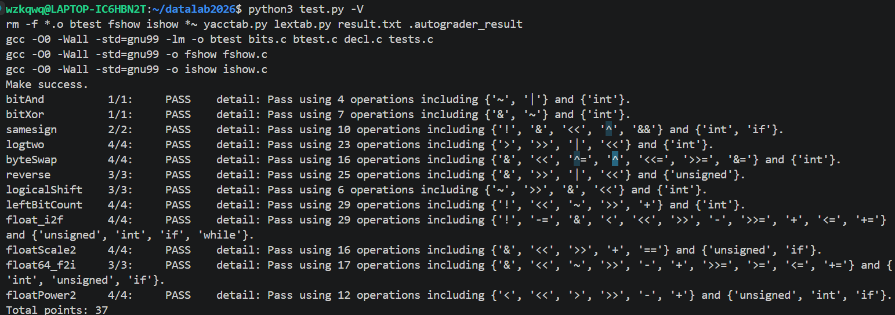

# datalab 报告

姓名：吴致楷

学号：2025201893

| 总分 | bitAnd | bitXor | samesign | logtwo | byteSwap | reverse | logicalShift | leftBitCount | float_i2f | floatScale2 | float64_f2i | floatPower2 |
| ---- | ------ | ------ | -------- | ------ | -------- | ------- | ------------ | ------------ | --------- | ----------- | ----------- | ----------- |
| 37   | 1      | 1      | 2        | 4      | 4        | 3       | 3            | 4            | 4         | 4           | 3           | 4           |

test 截图：



## 解题报告

### 亮点
1. byteSwap
2. reverse
3. logtwo

### bitAnd

```c
int bitAnd(int x, int y) {
    return ~(~x | ~y);
}
```


### bitXor

```c
int bitXor(int x, int y) {
    return ~(x&y) & ~(~x&~y);
}
```

逐位看，异或的结果位为 1 当且仅当两位不同。等价形式是 `(x|y) & ~(x&y)`，而 `x|y = ~(~x & ~y)`，代进去即得 `~(x&y) & ~(~x&~y)`。

### samesign

```c
int samesign(int x, int y) {
    if(!x && !y) return 1;
    if(!x) return 0;
    if(!y) return 0;
    x = x & (1 << 31);
    y = y & (1 << 31);
    if(x^y) return 0;
    else return 1;
}
```

题面规定 0 既不正也不负，所以先把涉及 0 的情况单独判掉：(0,0) 算同号，(0, 非 0) 算不同号。剩下的两数都非 0，取符号位异或，相同即同号。

### logtwo

```c
int logtwo(int v) {
    int r = 0, s;
    s = ((v >> 16) > 0) << 4;   v = v >> s;   r = r | s;
    s = ((v >> 8)  > 0) << 3;   v = v >> s;   r = r | s;
    s = ((v >> 4)  > 0) << 2;   v = v >> s;   r = r | s;
    s = ((v >> 2)  > 0) << 1;   v = v >> s;   r = r | s;
    r = r | ((v >> 1) > 0);
    return r;
}
```

二分确定最高位 1 的下标：`(v>>16) > 0` 说明最高位落在高 16 位，于是把答案的第 4 位置为 1 并整体右移 16；随后按 8、4、2、1一步一步做。

### byteSwap

```c
int byteSwap(int x, int n, int m) {
    int bitn = (n << 3), bitm = (m << 3);
    int n1 = (255 << bitn);
    int m1 = (255 << bitm);
    int _n = x & n1;
    int _m = x & m1;
    x ^= _n ^ _m;
    _n >>= bitn; _n <<= bitm; _n &= m1;
    _m >>= bitm; _m <<= bitn; _m &= n1;
    x ^= _n ^ _m;
    return x;
}
```

先用 `255 << (n*8)` 造出两个字节的掩码，把目标两字节整体取出；`x ^= _n ^ _m` 一次把这两位清空，再把取出的字节各自平移到对方位置再写回，&=m1和n1是为了防止带符号整数右移补1，把补的1给与掉。

### reverse

```c
unsigned reverse(unsigned v) {
    unsigned m;
    m = 0x0000FFFF; v = ((v & m) << 16) | ((v >> 16) & m);
    m = 0x00FF00FF; v = ((v & m) <<  8) | ((v >>  8) & m);
    m = 0x0F0F0F0F; v = ((v & m) <<  4) | ((v >>  4) & m);
    m = 0x33333333; v = ((v & m) <<  2) | ((v >>  2) & m);
    m = 0x55555555; v = ((v & m) <<  1) | ((v >>  1) & m);
    return v;
}
```

和线段树结构一样的道理，一层一层分治做，每次交换左右儿子就能做到反转。

### logicalShift

```c
int logicalShift(int x, int n) {
    int mask = ~(((1 << 31) >> n) << 1);
    return (x >> n) & mask;
}
```

C 的 `>>` 对有符号数是算术右移，高位会补符号位。`(1<<31) >> n` 得到高 n 位为 1 的串，左移一位后取反，掩码的低 32-n 位为 1，与 `x>>n` 相与即可抹掉补进来的符号位。

n = 0 时左移溢出为 0，掩码全 1。

### leftBitCount

```c
int leftBitCount(int x) {
    int y = ~x;
    int n = !y;
    int c;
    c = !(y >> 16); n = n + (c << 4); y = y << (c << 4);
    c = !(y >> 24); n = n + (c << 3); y = y << (c << 3);
    c = !(y >> 28); n = n + (c << 2); y = y << (c << 2);
    c = !(y >> 30); n = n + (c << 1); y = y << (c << 1);
    c = !(y >> 31); n = n + c;
    return n;
}
```

数的是最高位起连续 1 的个数，等价于找最高的那个 0。取 `y = ~x`，若 `y >> 16 == 0` 说明 x 的高 16 位全是 1，答案加 16 并把 y 左移 16 位；再查看 8、4、2、1 ，

最后补一位。x 全 1 时 `y == 0`，用 `!y` 初始化 1，补上第 32 个。

### float_i2f

```c
unsigned float_i2f(int x) {
    unsigned ans = 0, y = x, t, sh;
    int o = 0;
    if (x < 0) { y = -y; ans = 1u << 31; }
    if (!y) return 0;
    t = y;
    while (t) t >>= 1, ++o;
    y -= (1u << (o - 1));
    ans += (o + 126) << 23;
    if (o <= 24) ans += y << (24 - o);
    else {
        sh = o - 24;
        y = (y + (1u << (sh - 1)) - 1 + ((y >> sh) & 1)) >> sh;
        if (y >> 23) { ans += 1u << 23; y = 0; }
        ans += y;
    }
    return ans;
}
```

先取绝对值并置符号位；循环数出最高位位置 o，指数域填 `o + 126`。有效数不足 24 位直接左对齐；o > 24 时有截断，用 round-to-even 舍入（`+ 1<<(sh-1) - 1 + 末位`），若进位把尾数顶到第 24 位，则指数加 1、尾数清零。

### floatScale2

```c
unsigned floatScale2(unsigned uf) {
    unsigned s = uf & 0x80000000;
    unsigned E = (uf >> 23) & 0xFF;
    unsigned w = uf & 0x007FFFFF;
    if(E == 255) return uf;
    else if(E == 0) return (w << 1) + s;
    else if(E == 254) return s + ((E + 1) << 23);
    else return s + ((E + 1) << 23) + w;
}
```

按阶码分四类：E = 255 是 NaN / INF，原样返回；E = 0 是 denorm，直接左移尾数——`w << 1` 的进位会自然进入指数域，恰好从 denorm 变成 E = 1 的规格数；E = 254 再乘 2 会溢出成无穷，返回 `s | (255 << 23)`；其余情况指数加 1、尾数不动。

### float64_f2i

```c
int float64_f2i(unsigned uf1, unsigned uf2) {
    unsigned tmp = uf1;
    uf1 = uf2;
    uf2 = tmp;
    unsigned s = uf1 & 0x80000000;
    unsigned E = (uf1 >> 20) & 0x7FF;
    if(E <= 1022) return 0;
    else if(E >= 1054) return 0x80000000;
    else {
        unsigned o = E - 1023;
        o += 1;
        unsigned x = 0x80000000 + ((uf1 & 0x000FFFFF) << 11) + ((uf2 >> 21) & 0x7FF);
        x >>= (32 - o);
        if(s) return ~x + 1;
        else return x;
    }
}
```

先把两个参数换位，让高位 32 位落在 uf1，方便取符号位和 11 位阶码。E <= 1022 表示 |值| < 1，向零取整得 0；E >= 1054 已经超出 int 范围，返回 0x80000000 表示溢出；其余把尾数高 20 位接到隐含的 1 后面拼出整数有效数，右移 (32 - o) 位截出整数部分，负数取反加一。

$\cancel{别问我为什么要交换uf1和uf2，问就是一开始没仔细看写反了}$


### floatPower2

```c
unsigned floatPower2(int x) {
    if(x < -149) return 0;
    else if(x > 128) return 0x7F800000;
    else if(x < -126){
        unsigned o = -126 - x - 1;
        return ((1u << 22) >> o);
    } else {
        unsigned E = x + 127;
        return (E << 23);
    }
}
```

x < -149 太小直接给 0；x > 128 太大给 +INF；-149 <= x <= -127 落在 denorm 区间，位模式是 `1 << (x + 149)`，代码写成 `(1<<22) >> (-126 - x - 1)` 与之等价；其余是规格数，指数域直接填 `x + 127`。x = 128 时 `x + 127 = 255`，刚好也是 +INF

$\cancel{实则写到这里才发现应该让128直接进INF分支好一点，但不想改了反正也是对的}$


## 反馈/收获/感悟/总结

花了大概1.5h，除了前三题，能用操作少的题反而更难。

unsigned问题比int简单，float问题最简单（能用if else几乎和正常写代码没区别了）。

## 参考的重要资料

无